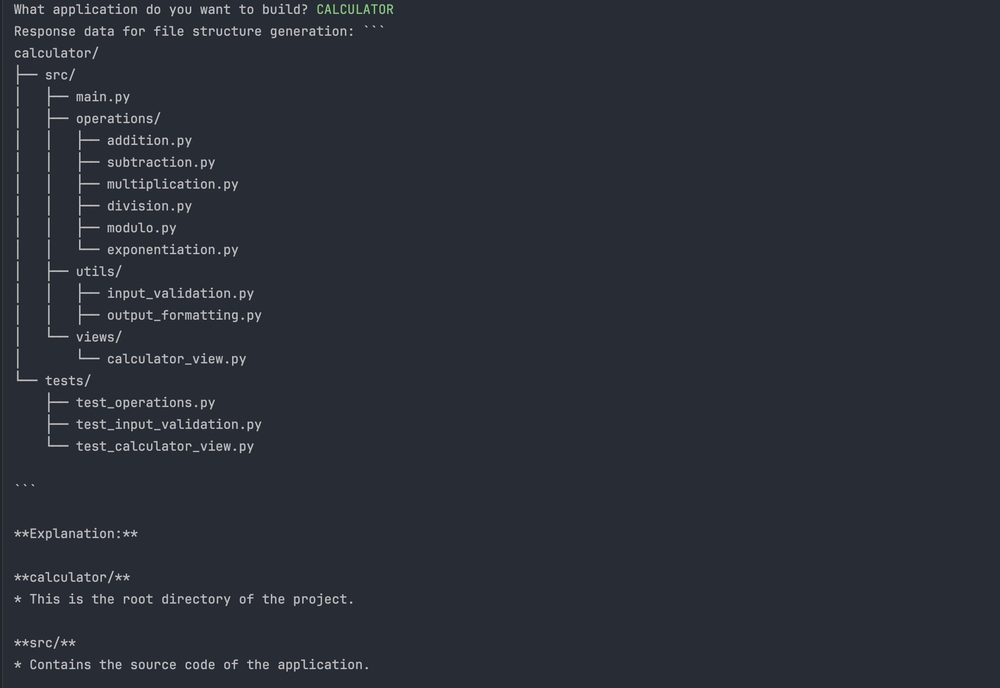
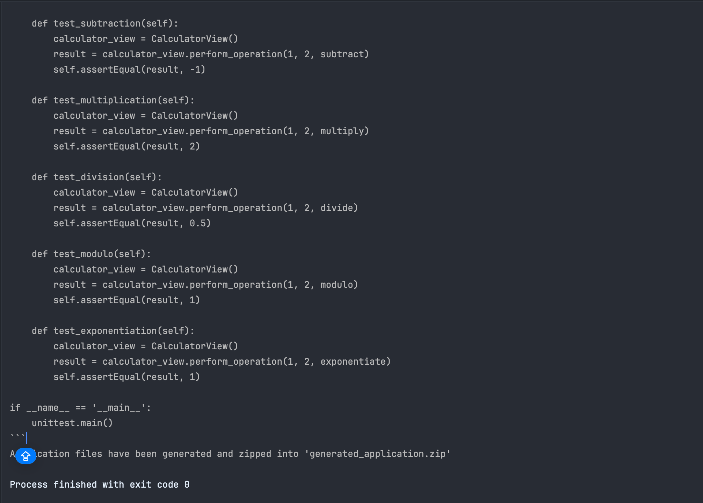
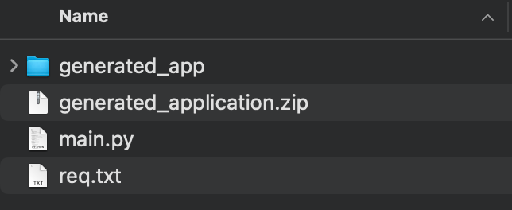

# Python Script for Generating Application Files Using GPT/AI

This Python script generates application files using the Gemini API, which provides access to Google's Gemini large language models. It takes user input on the type of application to build, sends the prompt to the Gemini API, generates the file structure and contents, and then zips the files into a single archive.

## Prerequisites

- Python 3.9+
- Dependencies installed via pip (`pip install -r req.xt`)

## Installation

1. Clone or download this repository.
2. Install the required dependencies using pip:

   ```
   pip install -r requirements.txt
   ```

3. Set up your Gemini API key by creating a `.env` file in the root directory and adding your key:

   ```
   GOOGLE_API_KEY=your_api_key_here
   ```

## Usage

Run the script `main.py` and follow the prompts to generate application files. 

```bash
python main.py
```

## Screenshots






